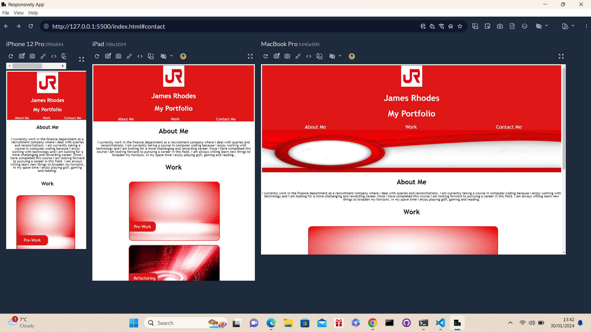

# Challenge Title
Creating my Portfolio

## What was my motivation and my objective for this project?

In this project my main motivation was to build a good portfolio page which I believe I have sucessfully been able to do by ensuring that when I type in the URL it successfully loads up my portfolio page in which I was able to encorporate anchor links that allows anyone to click on my navigation bar. For example the "About Me" section which then allows for the page to jump to that portion of the page.

In addition to this I was also able to successfully add links into my images which allows any user to click on my work and for it to then take them to the repositories on my Github page. I have also really enjoyed that i was able to make my webpage fully responsive which allows for the screen to adapt to multiple screen sizes as per the below screenshot

